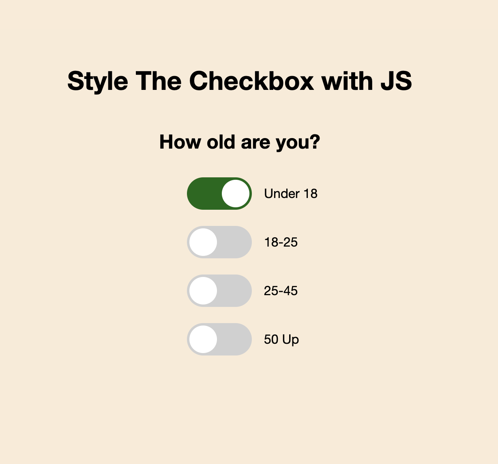

# styling-checkbox

Style The Checkbox with JS, CSS and html

# Yay Company design with React-Bootstrap & Styled Components



## Description

Style The Checkbox with JS, CSS and html

## Built With

-   [JavaScript](https://www.javascript.com/)
-   [CSS](https://www.w3schools.com/w3css/defaulT.asp)
-   [HTML](https://html.com/)

## Getting Started

### Installing

1. Clone the repo:

```bash
git clone https://github.com/nunsinee/styling-checkbox.git
```

### Reference

Applied code from JavaScript learning by Brad Traversy
